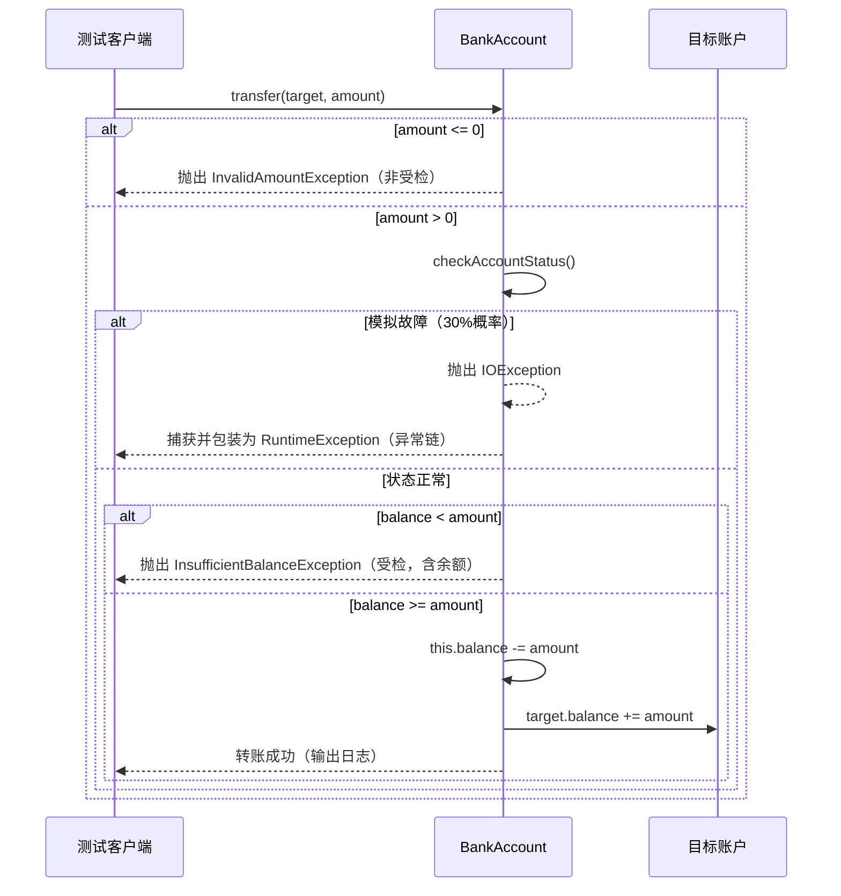

# BankAccount

## 项目简介

BankAccount 是一个纯 Java 实现的银行账户转账演示程序，重点展示**自定义异常**与**异常链**的运用。系统模拟账户间转账业务，涵盖金额合法性校验、余额不足检查、外部服务故障模拟，并通过受检异常（`InsufficientBalanceException`）与非受检异常（`InvalidAmountException`、`RuntimeException` 包装）分层处理错误，同时保留原始异常原因（异常链），便于问题定位。

------

## 类结构概览

```tex
├── BankAccount                           // 账户核心类（转账逻辑）
├── InsufficientBalanceException（受检异常） // 余额不足异常，携带当前余额
├── InvalidAmountException（非受检异常）    // 非法金额异常（金额≤0）
└── TestBankTransfer                       // 测试类（覆盖正常、非法、余额不足、异常链场景）
```


| 类/接口                        | 说明                                                         |
| :----------------------------- | :----------------------------------------------------------- |
| `BankAccount`                  | 持有账号和余额，提供 `transfer()` 方法，包含参数校验、外部状态模拟（30% 概率抛出 `IOException`）、余额判断及转账执行。 |
| `InsufficientBalanceException` | 受检异常（`extends Exception`），在余额不足时抛出，携带当前余额值，便于调用方获取详细信息。 |
| `InvalidAmountException`       | 非受检异常（`extends RuntimeException`），在转账金额 ≤0 时抛出，无需显式捕获。 |
| `TestBankTransfer`             | 测试入口，演示正常转账、非法金额、余额不足以及异常链（`IOException` 被包装为 `RuntimeException`）等多种场景，并输出最终余额。 |

------

## 架构设计

系统围绕 **异常分层处理** 与 **异常链包装** 进行设计：

- **业务逻辑层（BankAccount）**：封装转账核心流程，依次执行：
  1. 金额合法性检查 → 抛出 `InvalidAmountException`（非受检）。
  2. 外部账户状态模拟 → 可能抛出 `IOException`（受检），捕获后包装为 `RuntimeException` 并保留原异常（异常链）。
  3. 余额比较 → 不足时抛出 `InsufficientBalanceException`（受检）。
  4. 执行扣款与入账。
- **自定义异常层**：
  - `InsufficientBalanceException` 为受检异常，强制调用方处理或声明，并提供 `getCurrentBalance()` 获取现场余额。
  - `InvalidAmountException` 为非受检异常，代表编程错误（参数校验），不强制处理。
- **测试层（TestBankTransfer）**：针对不同场景进行 try-catch 捕获，并演示如何从 `RuntimeException` 中解包原始 `IOException`。

**设计原则**：

- **单一职责**：每个异常类仅表示一种错误类型，携带必要上下文。
- **异常链**：将低层受检异常（`IOException`）包装为高层运行时异常，避免污染方法签名，同时不丢失根因信息。
- **受检与非受检分离**：明确区分“可恢复的业务异常”（余额不足）与“编程错误”（非法金额），便于调用方制定不同处理策略。

------

## 核心流程

以下时序图展示一次完整的转账调用链路及异常分支：




客户端捕获顺序（示例中按优先级：`InsufficientBalanceException` → `InvalidAmountException` → `RuntimeException`），并可根据异常类型输出对应提示或解包原始异常。

------

## 核心特性

- **自定义异常体系**：区分受检（余额不足）与非受检（非法金额），语义清晰。
- **异常链机制**：将 `IOException` 包装为 `RuntimeException`，保留根因，提升调用灵活性。
- **业务状态携带**：`InsufficientBalanceException` 记录当前余额，便于前端展示或重试决策。
- **随机故障模拟**：`checkAccountStatus()` 以 30% 概率抛出 `IOException`，真实演示异常链场景。
- **完整测试覆盖**：`TestBankTransfer` 涵盖正常、非法金额、余额不足、异常链（循环重试）等典型场景。
- **控制台日志**：转账成功/失败均有清晰格式化输出，便于演示。

------

## 技术栈

| 组件 | 版本 / 说明                                     |
| :--- | :---------------------------------------------- |
| Java | JDK 8+（使用 `java.io.IOException` 及异常机制） |
| 构建 | 无外部依赖，纯 javac 编译                       |
| 测试 | 手动执行 `TestBankTransfer.main()`              |
| 文档 | Javadoc 注释，含异常声明及用法说明              |

------

## 快速开始

### 运行环境

- JDK 8 或更高版本
- 操作系统：Windows / macOS / Linux

### 编译与运行

```bash
javac *.java
java TestBankTransfer
```

------

## 压测数据

> 本项目为教学演示，未进行专门性能测试。
> 转账操作仅涉及简单算术与异常处理，单次执行耗时 < 1ms。
> 若需高并发场景，可考虑使用 `AtomicReference` 或数据库事务保证原子性，当前版本非线程安全。

------

## 后续规划

- **并发安全**：使用 `ReentrantLock` 或 `synchronized` 保证多线程转账原子性。
- **持久化**：将账户数据存储至文件或数据库，支持重启恢复。
- **日志框架**：替换 `System.out` 为 SLF4J / Log4j，便于日志级别控制。
- **单元测试**：引入 JUnit 5，针对异常分支编写自动化测试用例。
- **金额精度**：使用 `BigDecimal` 替代 `double`，避免浮点误差。
- **事务回滚**：若目标账户入账失败（如账户锁定），支持回滚源账户扣款。
- **RESTful API**：封装为 Web 服务，提供 HTTP 转账接口。