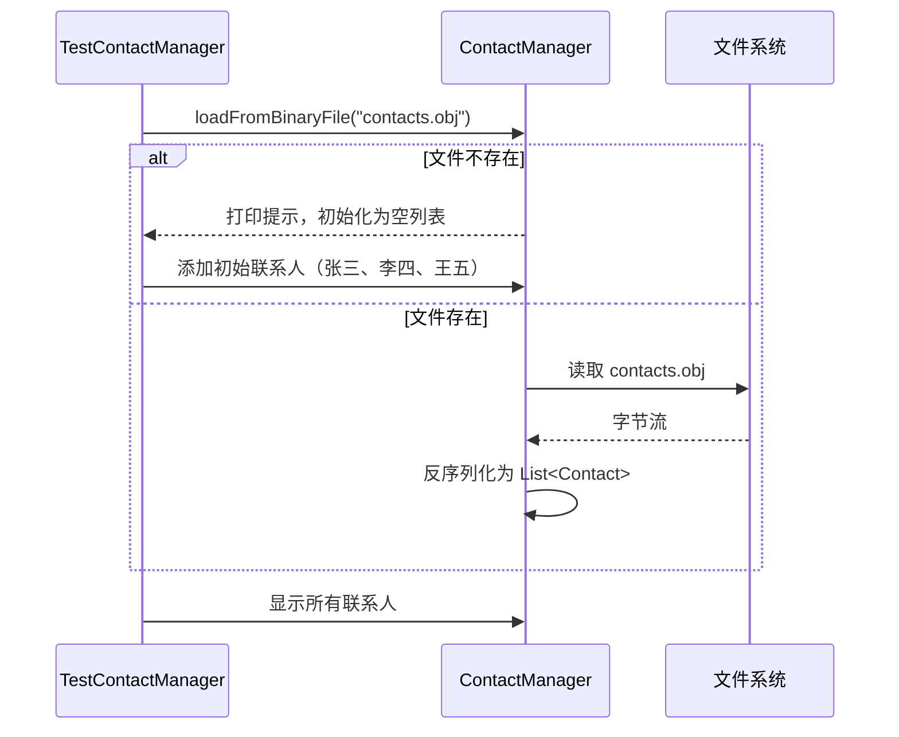
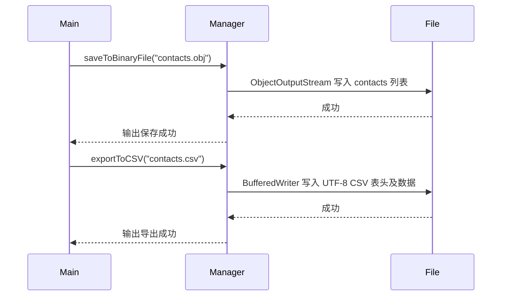
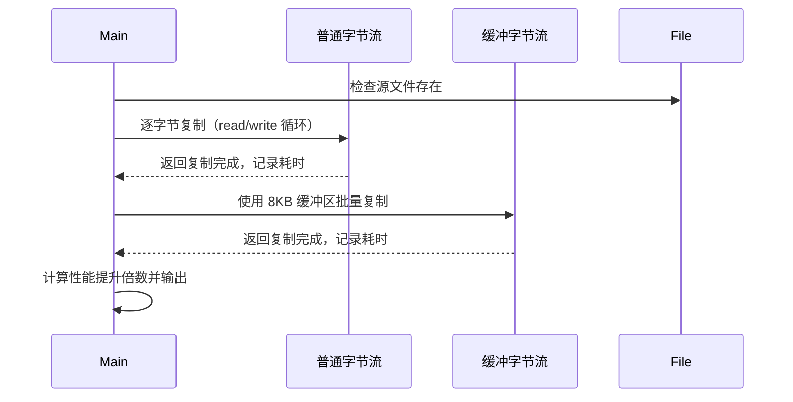

# ContactManager

## 项目简介

ContactManager 是一个纯 Java 实现的联系人管理演示程序，聚焦于**对象序列化**、**CSV 文件导出**以及**文件复制性能对比**。系统支持联系人的增删查改（内存操作），并将数据持久化为二进制文件（`ObjectOutputStream`/`ObjectInputStream`）或导出为 UTF‑8 编码的 CSV 文件。同时内建文件复制工具，对比普通字节流与缓冲字节流的性能差异，直观展示 I/O 缓冲区的优化效果。

---

## 类结构概览

```
├── Contact                              // 联系人实体类（实现 Serializable）
├── ContactManager                       // 联系人管理器（内存列表 + 持久化操作）
└── TestContactManager                   // 测试入口（演示增删查、序列化、CSV 导出、文件复制对比）
```

| 类/接口              | 说明                                                         |
| -------------------- | ------------------------------------------------------------ |
| `Contact`            | 包含姓名、电话、邮箱，实现 `Serializable`，提供 `serialVersionUID`。 |
| `ContactManager`     | 持有 `List<Contact>`，提供 `addContact`、`removeByName`、`findByName`；支持保存/加载二进制文件（序列化）以及导出 CSV。 |
| `TestContactManager` | 主程序：启动时加载历史数据，若为空则添加初始联系人；演示查找、删除、保存二进制、导出 CSV，并运行文件复制性能对比（普通流 vs 缓冲流）。 |

---

## 架构设计

系统采用 **分层职责** 与 **I/O 模式封装**：

- **实体层（Contact）**：纯数据载体，实现 `Serializable` 以便对象序列化。
- **业务逻辑层（ContactManager）**：封装内存集合操作与持久化细节，对外提供统一 API。持久化实现：
  - **二进制序列化**：使用 `ObjectOutputStream` / `ObjectInputStream` 保存/恢复整个 `ArrayList<Contact>`，依赖 `serialVersionUID` 保证兼容性。
  - **CSV 导出**：使用 `BufferedWriter` + `OutputStreamWriter` 指定 UTF‑8 编码，生成以中文逗号分隔的文本文件。
- **应用层（TestContactManager）**：驱动业务流程，包含文件复制对比方法 `copyFileCompare()`，分别采用：
  - 普通流（`FileInputStream` + `FileOutputStream`，逐字节读写）
  - 缓冲流（`BufferedInputStream` + `BufferedOutputStream`，8KB 缓冲区批量读写）
  

**设计原则**：
- **单一职责**：`ContactManager` 专注联系人管理，文件复制测试独立为静态方法。
- **异常处理**：I/O 操作均抛出或捕获并打印友好信息，序列化时处理 `ClassNotFoundException`。
- **资源管理**：所有流均使用 try‑with‑resources 自动关闭。

---

## 核心流程

### 1. 启动加载流程


### 2. 保存与导出流程


### 3. 文件复制性能对比流程


---

## 核心特性

- **联系人管理**：支持添加、按姓名删除、按姓名查找，内存存储。
- **二进制持久化**：使用 Java 序列化保存整个联系人列表，便于快速恢复。
- **CSV 导出**：以 UTF‑8 编码导出标准 CSV 文件（中文逗号分隔），可直接用 Excel 打开。
- **异常安全**：加载时若文件不存在自动初始化为空列表；I/O 异常均有捕获和提示。
- **文件复制性能演示**：直观对比普通字节流与缓冲字节流的效率差异，展示缓冲区的重要性。
- **自动初始样本数据**：首次运行时自动生成三条示例联系人，方便测试。

---

## 技术栈

| 组件 | 版本 / 说明                                         |
| ---- | --------------------------------------------------- |
| Java | JDK 8+（使用 `java.io`、`java.nio.charset` 标准库） |
| 构建 | 无外部依赖，纯 javac 编译                           |
| 测试 | 手动执行 `TestContactManager.main()`                |
| 文档 | Javadoc 注释，含 `@throws` 及 `@Serial` 标记        |

---

## 快速开始

### 运行环境
- JDK 8 或更高版本
- 操作系统：Windows / macOS / Linux

### 编译与运行

```bash
javac *.java
java TestContactManager
```

---

## 压测数据

> 本演示项目未进行大规模数据性能测试。  
> 基于 `ArrayList` 的操作（查找/删除）为 O(n)，在联系人数量 ≤ 10,000 时响应迅速。  
> 文件复制性能对比中，缓冲流（8KB 缓冲区）通常比普通字节流快 10~100 倍（取决于文件大小和操作系统），建议在实际项目中优先使用缓冲流或 `Files.copy()`。

---

## 后续规划

- [ ] **数据库持久化**：使用 SQLite 或 JDBC 替代序列化，支持更复杂的查询。
- [ ] **交互式命令行**：提供 CLI 菜单，支持用户交互式增删改查。
- [ ] **导入功能**：支持从 CSV 文件批量导入联系人（解析并合并）。
- [ ] **数据校验**：对电话、邮箱格式进行正则验证，防止无效数据。
- [ ] **多线程安全**：使用 `CopyOnWriteArrayList` 或同步机制保证并发访问安全。
- [ ] **图形界面**：使用 Swing 或 JavaFX 构建可视化联系人管理工具。
- [ ] **单元测试**：引入 JUnit 5 测试序列化、导出及查找删除逻辑。
- [ ] **日志框架**：替换 `System.out` 为 SLF4J，便于日志级别控制与文件记录。
