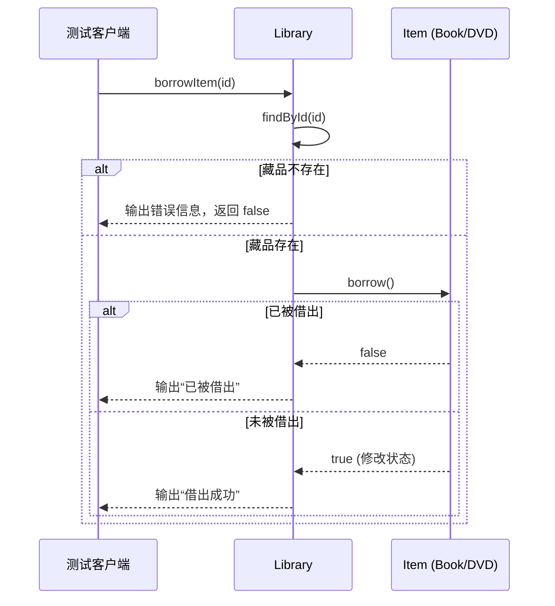
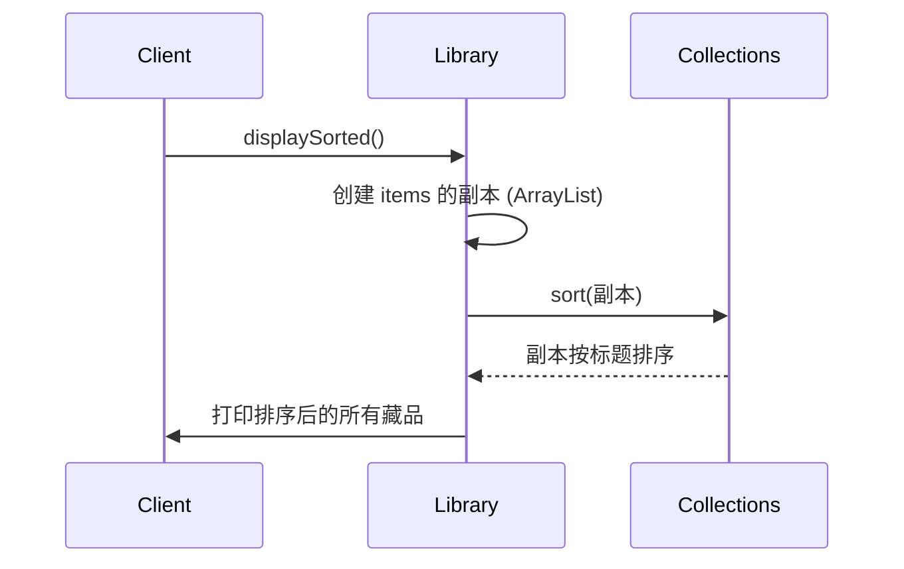

# LibrarySystem

## 项目简介

LibrarySystem 是一个轻量级的图书馆藏品管理演示程序，使用纯 Java 实现。它支持对图书（Book）和 DVD 两类藏品的统一管理，提供添加、借阅、归还、列表展示、按标题排序以及逾期罚金计算等功能。系统采用面向接口与抽象类的设计，便于扩展新的藏品类型。

------

## 类结构概览

```tex
├── Item（抽象类）                     // 藏品基类
│   ├── Book extends Item implements Chargeable
│   └── DVD  extends Item implements Chargeable
├── Chargeable（接口）                  // 逾期罚金计算契约
├── Library                             // 图书馆管理类（藏品增删改查、借还、显示）
└── TestLibrary                         // 测试入口（演示功能）
```


| 类/接口       | 说明                                                         |
| :------------ | :----------------------------------------------------------- |
| `Item`        | 抽象基类，包含编号、标题、借出状态，实现 `Comparable` 按标题排序，定义抽象方法 `getType()`。 |
| `Book`        | 图书子类，增加作者属性，罚金单价 0.5 元/天。                 |
| `DVD`         | DVD 子类，增加时长属性，罚金单价 1.0 元/天。                 |
| `Chargeable`  | 接口，定义 `getFine(int days)` 方法。                        |
| `Library`     | 核心管理类，使用 `ArrayList<Item>` 存储藏品，提供借还、显示、排序功能。 |
| `TestLibrary` | 测试类，演示完整操作流程及罚金计算。                         |

------

## 架构设计

系统采用 **面向对象** 的经典三层抽象：

- **抽象层（Item）**：提取所有藏品的共有状态（id, title, isBorrowed）与行为（借/还、比较），强制子类定义类型名称。
- **接口层（Chargeable）**：将“可产生罚金”这一能力以接口分离，支持多态调用。
- **实现层（Book / DVD）**：各自实现特有属性与罚金计算逻辑。
- **管理层（Library）**：封装藏品集合与业务操作，对外提供简洁的 API。

**设计原则**：

- **开闭原则**：新增藏品类型（如杂志）只需继承 `Item` 并实现 `Chargeable`（可选），无需修改现有代码。
- **依赖倒置**：`Library` 依赖于抽象 `Item`，不依赖具体子类。
- **单一职责**：每个类聚焦于自身功能（如 `Item` 负责状态，`Chargeable` 负责罚金）。

------

## 核心流程

以下时序图展示了借阅与归还的完整交互过程（以借阅为例）：




归还流程与借阅对称，调用 `returnItem()` 修改状态为未借出。

排序显示流程：




罚金计算由客户端直接调用实现了 `Chargeable` 的对象的 `getFine(days)` 方法。

------

## 核心特性

- **统一管理**：支持多种藏品（图书、DVD）共存于同一列表。
- **借还操作**：带状态校验，防止重复借出或重复归还，并给出明确提示。
- **自然排序**：`Item` 实现 `Comparable`，按标题升序排列（Unicode 顺序）。
- **罚金计算**：通过 `Chargeable` 接口为不同藏品定制日罚金单价。
- **扩展友好**：新增藏品类型无需修改 `Library` 或测试代码。
- **清晰输出**：所有操作均有控制台反馈，便于演示。

------

## 技术栈

| 组件 | 版本 / 说明                         |
| :--- | :---------------------------------- |
| Java | JDK 8+（使用 `java.util` 集合框架） |
| 构建 | 无外部依赖，纯 javac 编译           |
| 测试 | 手动执行 `TestLibrary.main()`       |
| 文档 | Javadoc 注释，含 `{@link}` 交叉引用 |

------

## 快速开始

### 运行环境

- JDK 8 或更高版本
- 操作系统：Windows / macOS / Linux

### 编译与运行

```bash
javac *.java
java TestLibrary
```

------

## 压测数据

> 本项目为教学演示系统，未进行正式性能压力测试。
> 基于 `ArrayList` 的线性查找时间复杂度为 O(n)，在藏品数量 ≤ 10,000 时响应均在毫秒级。
> 若有大规模数据需求，可考虑替换 `items` 为 `HashMap<String, Item>` 实现 O(1) 查找，或引入数据库。

------

## 后续规划

- **持久化存储**：使用文件或 SQLite 保存藏品与借阅记录。
- **借阅历史**：记录借阅人、借阅日期，支持逾期天数自动计算。
- **用户界面**：提供命令行交互菜单（CLI）或图形界面（Swing/JavaFX）。
- **唯一性校验**：添加藏品时检测 ID 重复，避免数据冲突。
- **泛型优化**：`Library` 可改为泛型类，限定 `Item` 子类。
- **单元测试**：引入 JUnit 对核心逻辑进行自动化测试。
- **日志框架**：替换 `System.out` 为 SLF4J 等结构化日志。