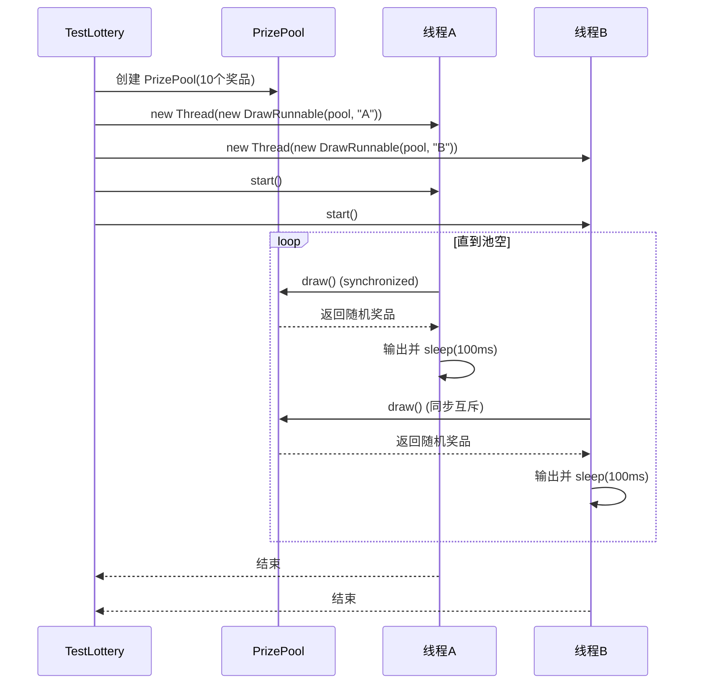
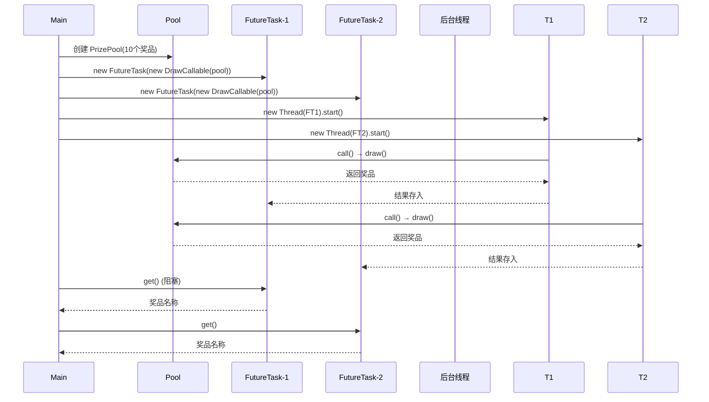
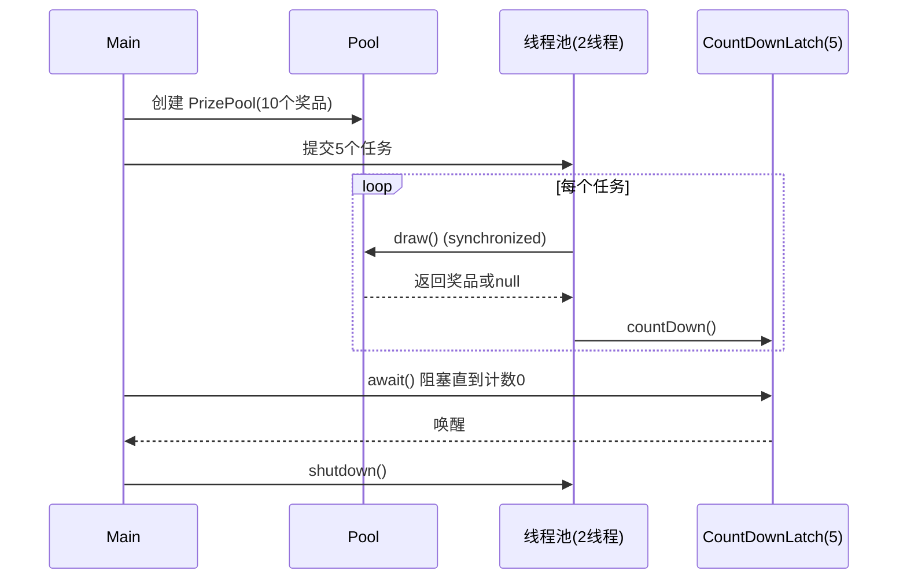

# Lottery

## 项目简介

Lottery 是一个纯 Java 实现的多线程抽奖演示程序，重点展示 **Java 并发编程** 的多种实现方式。系统包含一个线程安全的奖品池，支持使用 `Runnable`、`Callable` + `FutureTask` 以及线程池 + `CountDownLatch` 三种模式并发抽取奖品，直观对比不同并发工具的使用场景与效果。所有抽取操作均通过 `synchronized` 方法保证线程安全，确保每个奖品仅被抽中一次。

---

## 类结构概览

```
├── PrizePool                           // 奖品池（线程安全，随机抽取）
├── DrawRunnable implements Runnable     // 抽奖线程任务（持续抽取直到池空）
├── DrawCallable implements Callable<String> // 单次抽奖任务（返回结果）
└── TestLottery                          // 测试入口（演示三种并发方式）
```

| 类/接口        | 说明                                                         |
| -------------- | ------------------------------------------------------------ |
| `PrizePool`    | 持有奖品列表 `List<String>`，提供 `synchronized draw()` 随机移除并返回奖品，`synchronized isEmpty()` 判断是否为空。 |
| `DrawRunnable` | 实现 `Runnable`，在 `run()` 中循环调用 `draw()`，每次抽取后休眠 100ms 模拟间隔，直到奖品耗尽。 |
| `DrawCallable` | 实现 `Callable<String>`，`call()` 方法执行一次 `draw()` 并返回奖品名称，便于获取返回值。 |
| `TestLottery`  | 主程序，分别演示三种方式：<br>① 两个 `Thread` 运行 `DrawRunnable` 并发抽奖；<br>② 两个 `FutureTask` 封装 `DrawCallable` 并获取结果；<br>③ 使用 `ExecutorService` + `CountDownLatch` 控制 5 个任务并发抽奖。 |

---

## 架构设计

系统围绕 **线程安全的共享资源** 与 **多种任务提交模式** 构建：

- **资源层（PrizePool）**：使用 `ArrayList` 存储奖品，`Random` 生成随机索引。所有公共方法均用 `synchronized` 修饰，确保多线程环境下对列表的修改（`remove`）和查询（`isEmpty`）原子执行。
- **任务层（DrawRunnable / DrawCallable）**：封装抽奖逻辑，与 `PrizePool` 解耦，可灵活搭配不同线程执行框架。
- **并发控制层（TestLottery）**：
  - 方式一：原生 `Thread` 直接执行 `Runnable`，使用 `join()` 等待完成。
  - 方式二：`FutureTask` 包装 `Callable`，通过 `get()` 阻塞获取单次抽奖结果。
  - 方式三：固定线程池（2 个线程）执行 5 个任务，`CountDownLatch` 等待所有任务完成后再关闭线程池。

**设计原则**：
- **线程安全**：通过 `synchronized` 实现互斥访问，避免竞态条件。
- **任务分离**：抽奖逻辑与线程管理分离，便于测试不同并发模式。
- **灵活组合**：同一 `PrizePool` 可被多种任务使用，体现复用性。

---

## 核心流程

### 1. Runnable 方式（持续抽奖）


### 2. Callable + FutureTask 方式（单次抽奖）


### 3. 线程池 + CountDownLatch 方式


---

## 核心特性

- **线程安全奖品池**：使用 `synchronized` 保证 `draw()` 和 `isEmpty()` 的原子性，避免重复抽取。
- **三种并发模式演示**：
  - `Runnable` + `Thread`（无返回值，持续抽取）
  - `Callable` + `FutureTask`（有返回值，单次抽取）
  - 线程池 + `CountDownLatch`（批量任务同步等待）
- **随机抽取**：每次从剩余奖品中均匀随机选择一个，模拟真实抽奖。
- **模拟延时**：`DrawRunnable` 中每次抽取后休眠 100ms，体现并发交替执行。
- **清晰日志**：每个抽奖操作均输出线程名称与奖品，便于观察并发顺序。
- **无外部依赖**：纯 Java 标准库，编译运行简单。

---

## 技术栈

| 组件 | 版本 / 说明                              |
| ---- | ---------------------------------------- |
| Java | JDK 8+（使用 `java.util.concurrent` 包） |
| 构建 | 无外部依赖，纯 javac 编译                |
| 测试 | 手动执行 `TestLottery.main()`            |
| 文档 | Javadoc 注释，含并发说明                 |

---

## 快速开始

### 运行环境
- JDK 8 或更高版本
- 操作系统：Windows / macOS / Linux

### 编译与运行

```bash
javac *.java
java TestLottery
```

---

## 压测数据

> 本演示项目未进行大规模并发压力测试。  
> 基于 `synchronized` 的互斥在奖品数较少时无明显性能瓶颈。若需支撑高并发（如数千奖品、数百线程），可考虑使用 `ConcurrentLinkedQueue` 或 `AtomicReference` 等无锁结构，并采用 `ThreadLocalRandom` 替代 `Random` 提升随机数生成效率。

---

## 后续规划

- [ ] **无锁实现**：使用 `ConcurrentLinkedQueue` + `ThreadLocalRandom` 替换 `synchronized` + `Random`，提升并发吞吐量。
- [ ] **奖品权重**：支持按概率抽取（如奖品等级不同），实现加权随机。
- [ ] **抽奖历史记录**：记录每次抽取的线程、奖品、时间戳，便于审计。
- [ ] **图形界面**：使用 Swing 实现可视化的抽奖滚轮，增强交互性。
- [ ] **分布式抽奖**：扩展为多节点环境，使用 Redis 或 ZooKeeper 协调奖品池。
- [ ] **单元测试**：引入 JUnit 测试并发安全性（如多线程下奖品不重复、不丢失）。
- [ ] **日志框架**：替换 `System.out` 为 SLF4J，便于日志分级与输出控制。
